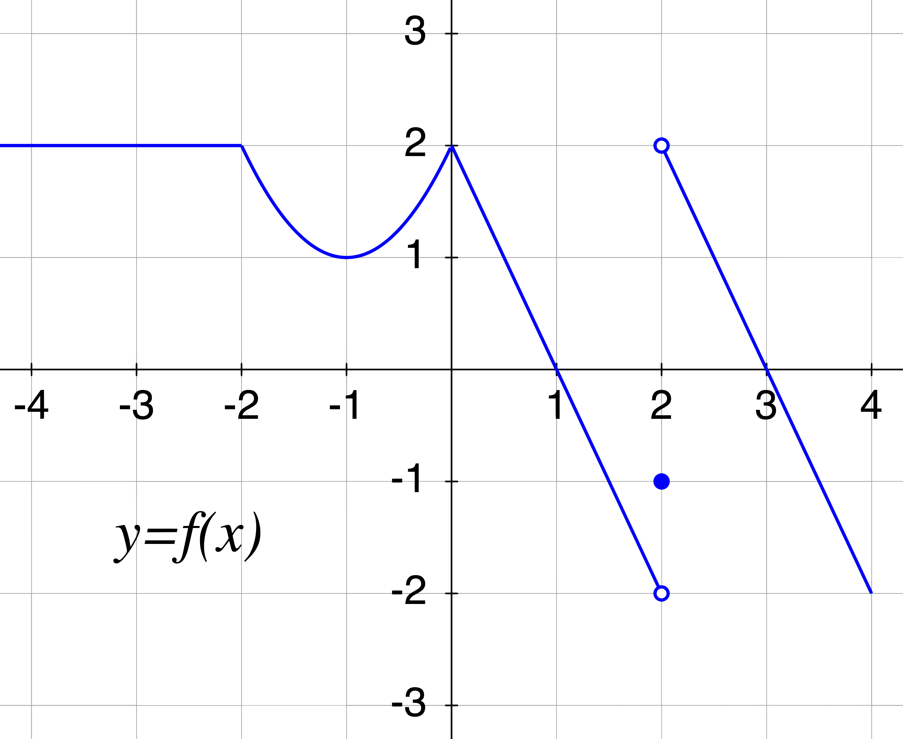
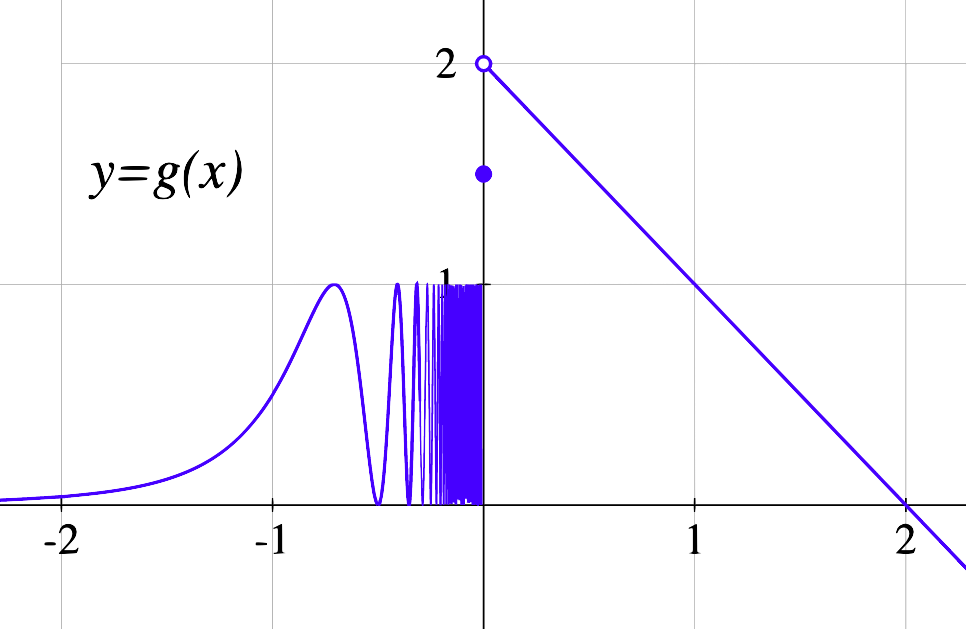
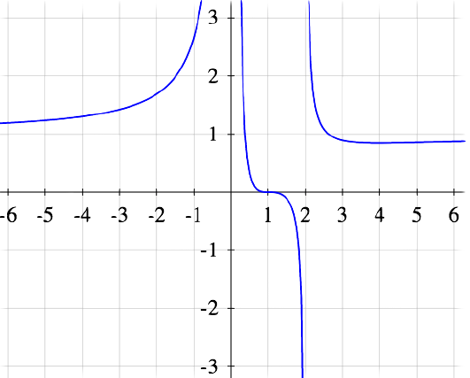
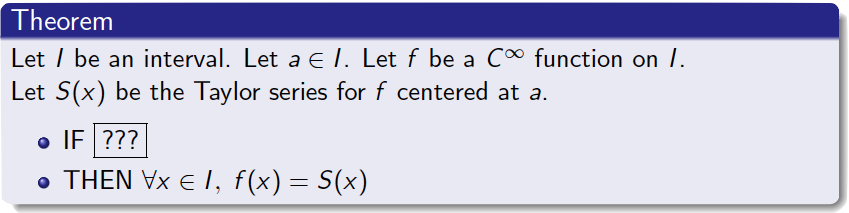
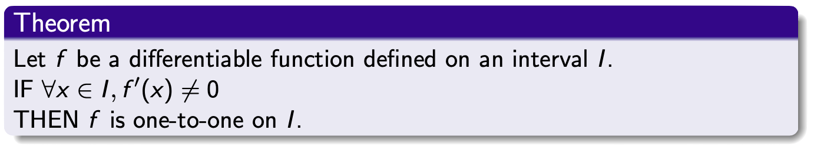
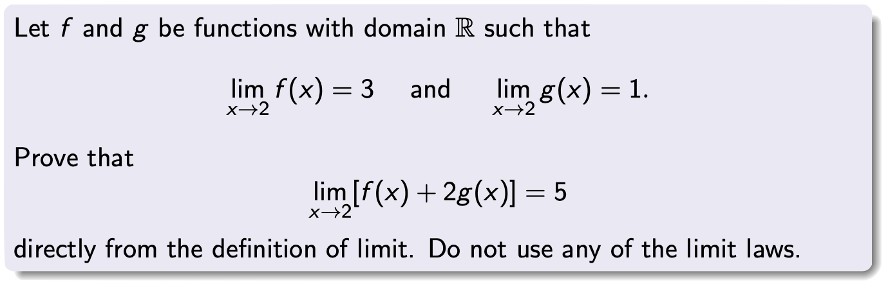
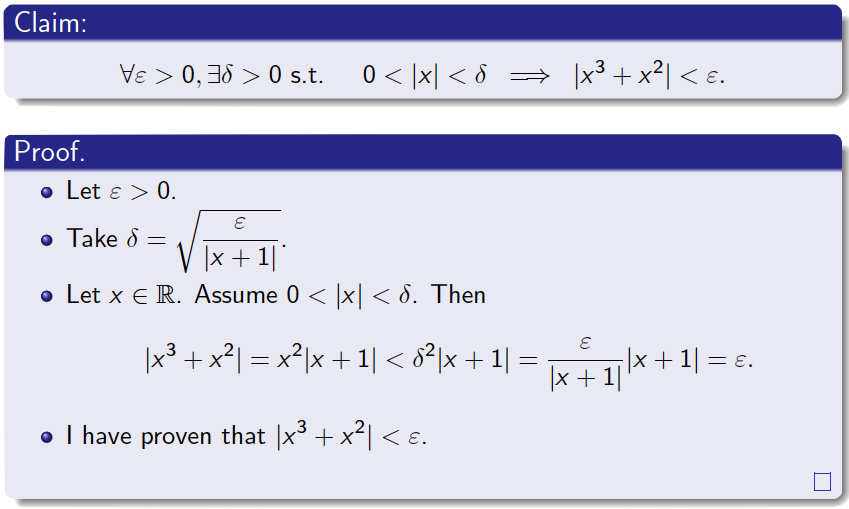

import React from "react";
import { Callout } from "nextra/components";
import {
    Example,
    Description,
    Question,
    Comments,
    Background,
} from "./_example";

# Commentated Examples of In-class Activities

This is not an exhaustive list. I just want to give you a sense of the richness of activities that may fit well in an inverted class, and some examples of what has worked well for me.

## Think-Pair-Share (and variants)

A “classic” Think-Pair-Share (TPS) question has a specific format:

-   You give students a multiple choice question and tell them to think individually.
-   After a while, they vote.
-   Only after that, they discuss with their neighbour.
-   Then they vote again.

The rationale is that 1) students are more likely to discuss after thinking about the question individually, and 2) a student with a good argument will convince a student with a bad argument, and the second vote will have moved towards the right consensus. But of course, you do not have to follow a rigid structure. Based on the outcome of a vote, I may decide to move on entirely (if most of the class got it), to ask a student to explain their answer, to ask them to discuss with their neighbours, to give them a hint or small explanation and then ask them to discuss, or to park the question temporarily and give them an easier question first that addresses the misconception.

Questions that will have the class split close to fifty-fifty between a right and a wrong option are great. They make students very eager to discuss. even above is one such question. Questions that most students will get wrong, but confidently wrong (as opposed to having no idea what to do) also work great.

<Example>
   <Description>
      This is a question about limits of composite functions.
   </Description>
   <Background>
      Students have learned the intuitive idea of limit, not the
      formal definition yet.
   </Background>
   <Question>
      I show students this graph and I ask them to find two limits

      

      Find the value of

      1. ${\displaystyle \lim_{x \to 2} f(x)}$

      2. ${\displaystyle \lim_{x \to 0} f(f(x))}$

      I ask them to vote (on multiple choice).

   </Question>
   <Comments>
    The vast majority of students confidently answers that none of the limits exists. I tell them that I disagree, that the answers to the two questions are different, and I invite them to discuss. They are surprised (they were certain to be right) and the class immediately erupts in discussion.

    After a while I ask them to vote again. If most of the students got it, I may ask one of them to explain it. But often they are still confused. Then I may use the following hint. I ask why the first limit does not exist. They tell me the side limits are different. So I write the four side limits on the board
    ${\displaystyle \lim_{x \to 2^+} f(x)}$, ${\displaystyle \lim_{x \to 2^-} f(x)}$,
    ${\displaystyle \lim_{x \to 0^+} f(f(x))}$, and ${\displaystyle \lim_{x \to 0^-} f(f(x))}$
    and ask them to compute them. They discuss with each other again. Without giving them the answer to the side limits, I ask them to vote on
    ${\displaystyle \lim_{x \to 0} f(f(x))}$
    again.

    Perhaps more of the students have the right answer now, but not enough. That tells me they need another bit of help. I ask them to compute
    ${\displaystyle f(f(0.1))}$,
    ${\displaystyle f(f(-0.1))}$
    and try again. More time to discuss with each other. We vote again. This time I am satisfied with how many got the right answer. Since this question was particularly tough and they worked hard, I will solve the question myself now. They earned it, and by now my explanation will be so much more useful than if I had solved the problem right away, like I would have done in a lecture.

    On the other hand, if students got the first question right immediately, or if I want further practice, I can follow up with a more challenging question. I give them the graph of a function
    $g$
    and ask them to evaluate the limits below.

    

    Find the value of

    1. ${\displaystyle \lim_{x \to 0^+} g(x)}$

    2. ${\displaystyle \lim_{x \to 0^+} \; \lfloor g(x) \rfloor}$

    3. ${\displaystyle \lim_{x \to 0^+} g(\lfloor x \rfloor)}$

    4. ${\displaystyle \lim_{x \to 0^-} g(x)}$

    5. ${\displaystyle \lim_{x \to 0^-} \; \lfloor g(x) \rfloor}$

    6. ${\displaystyle \lim_{x \to 0^-} \; \lfloor \frac{g(x)}{2} \rfloor}$

    7. ${\displaystyle \lim_{x \to 0^-} g(\lfloor x \rfloor)}$

    However, if I find the first question was pushing them enough, I will not use this second question.

    This is an example of how I react and change my plans based on how they are doing.

   </Comments>
</Example>

True-False questions, or “Which ones of these statements are equivalent to...”-questions work very well in this format. Students seem to like them.

<Example>
   <Description>
      This is a typical example of finding all the equivalent statements.
   </Description>
   <Background>
      Students just learned the definition of limit of a sequence. It is late in the course, so by now they can handle formal statements better than earlier.
   </Background>
   <Question>
      Let
      ${\displaystyle \{a_n\}_{n=0}^{\infty}}$
      be a sequence. Let
      ${\displaystyle L \in \mathbb{R}}$.

      Which statements are equivalent to
      ${\displaystyle ``\{a_n\}_{n=0}^{\infty} \longrightarrow L"}$?

      1. ${\displaystyle \forall \varepsilon>0, \; \exists n_0 \in \mathbb{N} \text{ s.t. } \forall n \in \mathbb{N}, \; \quad n \geq n_0 \implies |L-a_n| < \varepsilon.}$

      2. ${\displaystyle \forall \varepsilon>0, \; \exists n_0 \in \mathbb{N} \text{ s.t. } \forall n \in \mathbb{N}, \; \quad n \; {\color{red} > } \; n_0 \implies |L-a_n| < \varepsilon.}$

      3. ${\displaystyle \forall \varepsilon>0, \; \exists n_0 \in {\color{red} \mathbb{R}} \text{ s.t. } \forall n \in \mathbb{N}, \; \quad n \geq n_0 \implies |L-a_n| < \varepsilon.}$

      4. ${\displaystyle \forall \varepsilon>0, \; \exists n_0 \in \mathbb{N} \text{ s.t. } \forall n \in {\color{red} \mathbb{R}}, \; \quad n \geq n_0 \implies |L-a_n| < \varepsilon.}$

      5. ${\displaystyle \forall \varepsilon>0, \; \exists n_0 \in \mathbb{N} \text{ s.t. } \forall n \in \mathbb{N}, \; \quad n \geq n_0 \implies |L-a_n| \; {\color{red} \leq} \; \varepsilon.}$

      6. ${\displaystyle \forall \varepsilon \; {\color{red} \in (0,1)}, \; \exists n_0 \in \mathbb{N} \text{ s.t. } \forall n \in \mathbb{N}, \; \quad n \geq n_0 \implies |L-a_n| < \varepsilon.}$

      7. ${\displaystyle \forall \varepsilon>0, \; \exists n_0 \in \mathbb{N} \text{ s.t. } \forall n \in \mathbb{N}, \; \quad n \geq n_0 \implies |L-a_n| < {\color{red} \frac{1}{\varepsilon}}.}$

      8. ${\displaystyle \forall {\color{red} k \in \mathbb{Z}^{+} }, \; \exists n_0 \in \mathbb{N} \text{ s.t. } \forall n \in \mathbb{N}, \; \quad n \geq n_0 \implies |L-a_n| < {\color{red} k}.}$

      9. ${\displaystyle \forall {\color{red} k \in \mathbb{Z}^{+} }, \; \exists n_0 \in \mathbb{N} \text{ s.t. } \forall n \in \mathbb{N}, \; \quad n \geq n_0 \implies |L-a_n| < {\color{red} \frac{1}{k}}.}$

   </Question>
   <Comments>
      First, I tell them to work individually. I walk among them and I see how they are doing. I can see every time they record a “T” or “F” on their paper, so I see their pace. Once I decide it is time (most have probably not finished yet) I ask them to vote. For a few of them there will be consensus. I record those answers on the board and will not explain or discuss them. But for others there is disagreement or they are reluctant to answer (which means they do not know). So I point out the questions we do not have consensus on yet and tell them to discuss those with their neighbours. After a while we vote on just those again. Based on their replies, I will decide what to do. If at some point I think they are slowing down and they need a boost of energy, a good hint to restart the discussion is how many correct statements there are.
   </Comments>
</Example>

## Explorations

Sometimes I use longer questions, perhaps even vague or open-ended, where I want students to explore and play with a problem to “discover” a result, a formula, an algorithm, or a concept. These questions are a bit harder to pull off, but extremely satisfying when they work, both for students and for us.

<Example>
   <Description>
      This example contains a question about asymptotes with a hidden secondary goal.
   </Description>
   <Background>
      Students had watched a video of an example of how to compute the asymptotes of a function given its equation.
   </Background>
   <Question>
      In class I gave them this question:
      This is the graph of
      $y = R(x)$. $R$ is a rational function (a quotient of polynomials). Find its equation.\
       \
       

      I told them to go to Desmos in their devices and to test their hypotheses. They love that!

   </Question>
   <Comments>
      My apparent goal for this question was to discover how the roots in denominator and numerator, and their multiplicity, affect the shape of the graph. But I had a more important goal in mind. I wanted students to practice their problem-solving skills, to be comfortable making and testing conjectures, exploring, being creative, and basically researching. I wanted them to experience the joy of discovering math.

      I was not prepared for how well this worked out.[^1]  There quickly was a lot of energy in the class and students were enthusiastic. Many groups had animated discussions with plenty of “aha”-moments I even saw some high fives among them when they had a breakthrough. After 10 minutes, I asked if they were ready to discuss the question, or whether they wanted more time. They very firmly asked for more time. This was a good sign, as normally students would prefer me to explain solutions if asked. So I changed my plan, I wrote a challenge question on the board for those who had finished, and let the rest keep working. I could hardly keep up with the many group of students who were calling me to show me their work or ask me questions.

      [^1]: Not all questions work this well, but this shows that it is worth it for us to experiment, even if a question may sometimes flop.

   </Comments>
</Example>

Sometimes an opportunity presents itself serendipitously.

<Example>
   <Description>
      This is an example of a question that I created based on students inquiries.
   </Description>
   <Background>
      Students had watched a video where I explained how to use Lagrange’s Remainder Theorem to bound the error of a Taylor polynomial and, as an application, how to prove that
      ${\displaystyle f(x)=e^x}$
      was analytic at
      $a=0$. In class, I guided them through proving that
      ${\displaystyle f(x)=\sin x}$
      was analytic at
      $a=0$. In the process, some students were starting to notice a pattern and were inquiring about a general theorem.
   </Background>
   <Question>
      After the exercise, I improvised and wrote the following on the board

      

      I asked them to come up with a condition to replace $???$ that would make this theorem true.

   </Question>
   <Comments>
      After discussion among themselves, students were answering “the derivatives have to be bounded”. I asked them to formalize this as a very precise statement. I had to prod them some more so they would remember to quantify all their variables. As I walked among them, I took note of who had interesting answers (both right and wrong ones). I asked them to share their answers (sometimes calling on them directly) and I copied them on the board. They gave me some answers like

      1. ${\displaystyle \forall n \in \mathbb{N}, \forall x \in I}$, $f^{(n)}$ is bounded between $x$ and $a$.

      2. ${\displaystyle \forall n \in \mathbb{N}, \forall x \in I}$, $\exists M \in \mathbb{R}$ such that $\forall \xi$ between $x$ _&_ $a$, $| f^{(n)}(\xi)| < M$

      3. ${\displaystyle \forall x \in I}$, $\exists M \in \mathbb{R}$ such that $\forall n \in \mathbb{N}$, $\forall \xi$ between $x$ _&_ $a$, $| f^{(n)}(\xi)| < M$

      4. ${\displaystyle \forall x \in I}$, $\exists A, B \in \mathbb{R}$ such that $\forall n \in \mathbb{N}$, $\forall \xi$ between $x$ _&_ $a$, $A < f^{(n)}(\xi) < B$

      5. ${\displaystyle \forall x \in I}$, $\exists A, B \in \mathbb{R}$ such that $\forall n \in \mathbb{N}$, $A < f^{(n)}(x) < B$

      I told them to discuss with their neighbours which one or ones would be valid answers. Then they voted. They had already come to a consensus on the correct ones, so I asked someone to explain to the class why, and they did.

      Next, I noticed that since various answers were right we had various correct theorems, and I asked them to consider “Which of the correct theorems is the most useful one?” In particular, they had to figure out what “useful” meant. I wanted them to realize that the theorem with the weakest hypotheses would be the most useful. The discussion continued some more. At the end I told them the definition of “uniformly bounded” (they had already discovered the concept, they just needed a name for it).

      Through this exercise, students got a first taste of what research is like: coming up with an interesting question moving from examples to a general case, writing precise statements, testing their hypotheses, coming up with new theorems.

   </Comments>
</Example>

## Warm-ups

I often like to begin with a warm-up question. This is a quick question that requires no explanation, that students can jump on working right away, and that should be no problem to any student who is trying to do their part. If I begin my class at 9:10am, I want the question up and students working on it by 9:11am, and the question fully resolved (and we have moved on) by 9:15am. This also establishes that the class has officially started, and everybody is immediately active and participating.

Sometimes the warm-up question can be a review, and this serves an additional purpose. Early in the semester, it is a good idea to use warm-up questions that are very similar to the examples in the videos so that you know whether students are watching the videos or not. If many students don’t answer or answer incorrectly, this will be a great opportunity to remind them of the importance of watching the videos before class.

<Example>
   <Description>
      This is simple question designed to help students determine whether they understand some basic concepts or not.
   </Description>
   <Background>
      In the previous classes we had learned about improper integrals, the main family of examples, of the Limit-Comparison Test. Today we are working on something new, but first we begin with this review question.
   </Background>
   <Question>
      I asked students whether the following integrals are convergent and divergent.

      1. ${\displaystyle \int_1^\infty \frac{1}{x^{2}} \, dx}$
      2. ${\displaystyle \int_1^\infty \frac{1}{x} \, dx}$
      3. ${\displaystyle \int_1^\infty \frac{1}{\sqrt{x}} \, dx}$
      4. ${\displaystyle \int_1^\infty \frac{x+1}{x^{3}+2} \, dx}$
      5. ${\displaystyle \int_1^\infty \frac{\sqrt{x^{2}+5}}{x^{2}+6} \, dx}$
      6. ${\displaystyle \int_1^\infty \frac{x^{2}+3}{\sqrt{x^{5}+2}} \, dx}$

   </Question>
   <Comments>
      I give students two minutes to think, and then I ask them to vote. By this time of the course. (It takes quite some training and prodding, to get to this point.) I have them trained so I can say “Everybody answer loudly together. Is it convergent, yes or no? Number 1?” (they answer) “Number 2?” (they answer) ... I am hoping that the majority has gotten the right answer and then I move on without further discussion.

      What is the point of this question? We had worked on much more complicated examples earlier, but these are the basic ones, the ones we want all students to know confidently and quickly, the ones they are going to build up on later. They should not be moving to the next unit without this. In general, it is easy for a student to fall behind and convince themselves that “It is okay. Everybody is equally confused.” By resolving this question with all students answering loudly, I am making it apparent to those who are behind that no, that is not happening to everyone, and any student who is doing their part is getting at least this question. In later questions everybody will be equally confused, but for this one they should not be.

      Of course, if I miscalculated, I can always convert this question into a regular Think-Pair-Share.

   </Comments>
</Example>

## Computations

While we normally prefer to use class time for conceptual questions, there is room for a bit of computational practice every now and then. We do want students to gain some fluency after all.

When we do computational practice, I normally post a bunch of questions at once and give them a good chunk of time, while I walk around them, check on what they are doing, and answer their questions. Depending on how they are doing I decide how much time I have to wait, whether they are on top of things and I can move on, or I should solve an example myself, or point out a common error, or something else. I never feel the need to go through all the problems. Normally the last question is a harder one to slow down the fastest students, and I do not care if most students do not get to it (I do remind them of this). I will only discuss problems that most of them have worked on.

I suggest you avoid the temptation of spending a lot of time working through many examples in detail yourself. That is what the videos are for. Moreover, students have access to literally thousands of other worked-out examples with a simple search on YouTube. Remember that is is not necessary for you to “cover” all the heuristics, even though you will likely feel the need to.

<Example>
   <Description>
      This example has computational questions with different levels of difficulty including one hard question to keep busy the students that found everything else too easy.
   </Description>
   <Background>
      Students had learned the Ratio Test for convergence of series in a video and watched a couple of examples.
   </Background>
   <Question>
      In class, I asked students to use the Ratio Test to decide which of the following series are convergent:

      1. ${\displaystyle \sum_{n=1}^\infty \frac{3^{n}}{n!}}$
      2. ${\displaystyle \sum_{n=1}^\infty \frac{(2n)!}{n!^{2}3^{n+1}}}$
      3. ${\displaystyle \sum_{n=2}^\infty \frac{1}{\ln n}}$
      4. ${\displaystyle \sum_{n=2}^\infty \frac{n!}{n^{n}}}$

   </Question>
   <Comments>
      I began by giving them 10 full minutes to work on while I walked among them and talked to some of them. They were proceeding slower than I thought (We always forget what is like doing things for the first time). Most students (the ones who had watched the videos at least) could solve 1, perhaps slowly, perhaps discussing with friends, and perhaps rereading their notes or rewatching the video in their tablets. There were some errors in 2, some did not know what to do in 3 after the test is found inconclusive, and few of them had gotten to 4.

      I told them that I saw consensus that 1 was convergent and we were going to move on. I told them I would discuss instead only 2 and 3, to take a bit more time, and to discuss with their neighbours if they had not done so. After a while, I explained the common error I had seen in their answers to 2, and I led a discussion of what to do with 3. I did not touch 4; it was there to keep busy the students that found everything else too easy.

   </Comments>
</Example>

## Proofs

Learning to read, understand, critique, and write proofs is one of the major learning objectives of the course, so it makes sense to spend some class time on it. Alas, this is the most difficult skill to tackle. I will explain the tools I normally use, although I acknowledge this is what I am least confident on.

First, what not to do. It is tempting to spend large amounts of time writing full proofs on the board in detail while students copy them. But that is a lecture, not active learning. Students already have that in the videos (which they can rewind, pause, and rewatch). If they want more examples of detailed proofs, they can find tons online or in the textbook. Instead, we want them to start writing proofs themselves. They will struggle, because they find this difficult, and they will be insecure, because they do not know if they are right. But if you manage to make them spend time actively trying, you have already succeeded.

The simplest activity I use is to give students a simple claim, some guidance on the proof, and ask them to write it out in full.

<Example>
   <Description>
      In this example, I give students the steps that they need to follow to complete a proof. I hope they can follow them and gain some confidence.
   </Description>
   <Background>
      Students have watched a few proofs with the same concepts in the videos.
   </Background>
   <Question>
      We want to prove this theorem

      

      Follow these steps to write down the proof:

      1. Transform   ${\displaystyle [P \implies Q]}$   into   ${\displaystyle [(\text{not } Q) \implies (\text{not } P)]}$.\
         You get an equivalent Theorem (call it “Theorem 2”).\
         We are going to prove Theorem 2 instead.

      2. Write the definition of “$f$ is not one-to-one on $I$”. You will need it.

      3. Recall the statement of Rolle’s Theorem. You will need it.

      4. Do some rough work if needed.

      5. Write a complete proof for Theorem 2.

      <Callout type="error" emoji="⚠️">
         **Warning:** students will be much slower than you expect.
      </Callout>

   </Question>
   <Comments>
      Even if I simply give them this activity, wait for them to write the proof, and after
      that I write the proof myself on the board, this is going to be much more useful
      than writing multiple proofs by myself on the board without them having participated.
   </Comments>
</Example>

Taking it a step further, sometimes I first ask them to write a proof (with guidance), and then I help them to check the proof for correctness, and give each other’s feedback.

<Example>
   <Description>
      The goal of this activity is for student to give each other feedback on their proof writing.
   </Description>
   <Background>
      Students have watched a video that explains how to come up with, and write a full proof of the limit law for sums.
   </Background>
   <Question>
      First I give them this activity in class

      

      1. Write down the formal definition of the statement you want to prove.
      2. Write down what the structure of the formal proof should be, without filling the details.
      3. Rough work.
      4. Write down a complete proof.

   </Question>
   <Comments>
      Notice that it is very similar to what they saw in the video. There is no value in me writing a proof for this at all. (They can rewatch the video!) Rather, today we are going to practice how to criticize proofs and give feedback. Once I have given them enough time and many have a draft, I ask them to pair up, trade proofs, and give each other feedback following these prompts:

      5. Is the structure of the proof correct? (First fix $\varepsilon$, then choose $\delta$, then ...)

      6. Did you say exactly what $\delta$ is?

      7. Is the proof self-contained? (I do not need to read the rough work)

      8. Are all variables defined? In the right order?

      9. Do all steps follow logically from what comes before? Do you start from what you know and prove what you have to prove?

      10. Are you assuming the conclusion?

      I hope they get comfortable with writing proofs together and checking each other’s proofs. It will be valuable when they study.

   </Comments>
</Example>

An activity that students seem to enjoy a lot is “Find the error in this proof”.

<Example>
   <Description>
      Learning to identify a common error.
   </Description>
   <Background>
      This is part of learning to prove that a limit exists from the definition.
   </Background>
   <Question>
      I give student this question

      

      together with some guidance on the proof (which I am omitting now). Then I ask them to discuss with each other. After that, I ask them to find the error in this proof

      

   </Question>
   <Comments>
      This is an error students make very often, and I am certain many of them have made it today. I invite them to discuss the question with each other. Once I am satisfied that enough of them have realized the error, I ask them to explain it to the class. I hope this makes it more memorable, they learn not to do this in the future, and they learn to find this error when they are checking each other’s proofs. I do not write the details of this proof in the board.
   </Comments>
</Example>
